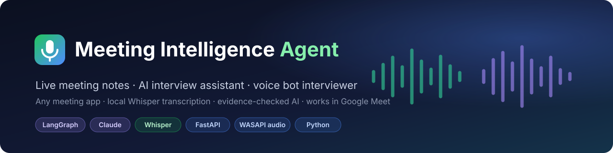
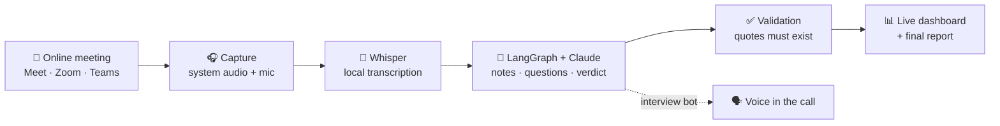
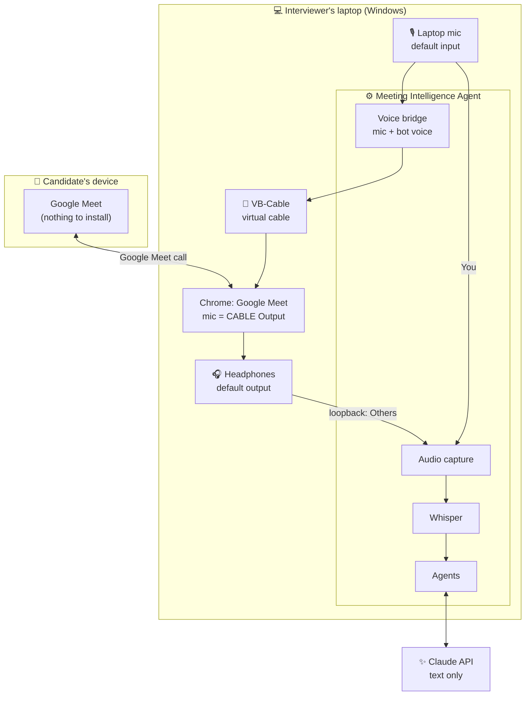
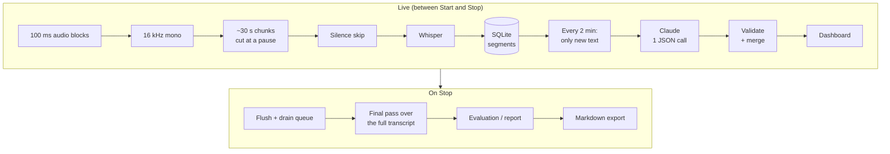
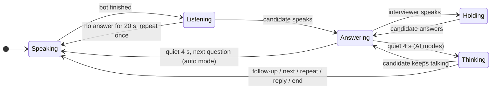

<p align="center">
  
</p>

<p align="center">
  
  
  
  
  
  <br>
  
  
  
  
</p>

<p align="center">
  <b>Join any online meeting as usual. The Meeting Intelligence Agent listens on your laptop, writes the notes,<br>
  prepares and tracks interview questions, and can even ask them out loud in the call.</b>
</p>

<p align="center">
  🔒 The source code is kept in a private repository. <a href="#-source-code">Access on request</a>.
</p>

<p align="center">
  <a href="#-how-it-works">How it works</a> ·
  <a href="#-interview-bot-modes">Interview bot</a> ·
  <a href="#-trustworthy-ai-by-design">Trustworthy AI</a> ·
  <a href="#%EF%B8%8F-tech-stack">Tech stack</a> ·
  <a href="#%EF%B8%8F-project-structure">Structure</a> ·
  <a href="#-source-code">Source code</a>
</p>

---

## ✨ Highlights

| | |
|---|---|
| 🎧 **Works with any meeting app** | Captures Windows system audio (WASAPI loopback) and your microphone. Google Meet, Zoom and Teams all work, with no platform API, OAuth or bot participant joining the call. |
| 🔐 **Private by design** | Speech-to-text runs **locally** with Whisper on the CPU. Audio never leaves the laptop; only transcript text goes to the AI. A fully local mode with Ollama is also available. |
| 📝 **Live meeting notes** | A LangGraph pipeline keeps a running summary, decisions, action items (owner / deadline / status), risks and open questions, and exports a Markdown report at the end. |
| 🎯 **Interview assistant** | Reads the candidate's resume (PDF / DOCX / TXT), prepares 10-12 resume-specific questions, rates each answer live with a quote, and writes a verdict with skill scores and a resume-claim check. |
| 🗣️ **Voice bot in the call** | A synthetic voice speaks in Google Meet through a virtual audio cable, mixed with your own microphone. Click to ask, or let it run the interview by itself. |
| 🤖 **Autonomous interviewer** | Detects when the candidate has finished answering, asks AI-chosen follow-ups, repeats questions on request, answers the candidate's questions without inventing facts, then wraps up and creates the report. |
| 🛡️ **Evidence-checked AI** | Every decision, action item and rated answer must quote the transcript or it is dropped. Owners and deadlines must actually have been said. |
| ⚙️ **Zero-setup local app** | One double-click starts it. FastAPI on `127.0.0.1`, SQLite, a no-build dashboard, and 104 automated tests. |

---

## 🔄 How it works

### The 30-second version



### Who is where



> The bot is not a separate participant. It speaks through the interviewer's own Meet microphone, so the candidate hears one combined voice.

### Processing pipeline



---

## 🗣️ Interview bot modes

| Mode | What the bot does | AI per answer |
|---|---|---|
| **Manual** | Speaks only when the interviewer clicks *Ask*, a quick phrase, or types text. | No |
| **Auto next question** | Greets, asks question 1, and after each answer says "Thank you" and asks the next planned question. | No |
| **Auto + follow-ups** | After each answer, Claude chooses one follow-up on that answer (vague, no "how", unverified resume claim) or moves on. | Yes |
| **Full auto interviewer** | Runs the whole interview: questions, follow-ups, repeats, polite replies, invites the candidate's questions, says goodbye and stops the recording. | Yes |

### Turn taking



- **Voice activity detection** on 100 ms frames of the live audio, checked every 0.2 s. A source counts as talking only when 3 of the last 10 frames are voiced, so clicks and notification sounds are ignored.
- **Fast decisions:** the answer is transcribed in ~12 s pieces *while* the candidate talks. Claude runs at low effort and replies in roughly 4-15 s; after 2.5 s the bot says "Okay." so there is no awkward silence.
- **The human stays in control:** talk at any time and the bot waits; *Pause*, *Next question* and the mode selector are always on the dashboard.

---

## 🛡️ Trustworthy AI by design

| Risk | What the code enforces |
|---|---|
| Made-up decisions or action items | Each item must quote evidence found in the transcript (fuzzy matched), or it is dropped. |
| "Maybe we should..." treated as a decision | Tentative wording without commitment language ("let's", "agreed") is rejected. |
| Invented owners and deadlines | An owner must be a name said in the meeting (pronouns become *Unknown*); a deadline must appear word for word. |
| Unsupported hiring verdict | An answer counts only with a quote of the candidate's own words. With no verified answers the AI can never recommend *Hire*, and confidence is forced to *Low*. |
| Bias | Prompts forbid using or inferring protected characteristics; only job-relevant evidence is judged. |
| Prompt injection in resumes or speech | Resume, job description and transcript are treated as data; outputs are clamped to fixed enums and checked against evidence. |
| An AI interviewer going off-script | Allowed actions are limited in code per mode: at most one follow-up per question, a time limit, and no invented company or salary facts. |
| Over-reliance on AI | The verdict is labelled advisory, and the interviewer records their own decision separately. |

---

## 🛠️ Tech stack

| Area | Technology |
|---|---|
| **AI / LLM** | Claude API (structured JSON output), LangGraph, optional Ollama for fully local runs |
| **Speech** | faster-whisper (CTranslate2, int8 on CPU, 0.33x real time), Windows offline text-to-speech |
| **Audio** | PyAudioWPatch (WASAPI loopback + microphone), VB-Cable virtual audio device, NumPy resampling and voice-activity detection |
| **Backend** | Python, FastAPI, Pydantic, SQLite, background worker threads |
| **Frontend** | Vanilla JavaScript, HTML and CSS (no build step), 1-second status polling |
| **Quality** | pytest (104 tests with fake LLM, transcriber and replayed audio), diagnostic scripts per layer |

---

## 🗂️ Project structure

```text
backend/app/
  main.py            app wiring: meeting manager, voice bridge, autopilot
  api/               REST API for the dashboard
  audio/             WASAPI capture, chunking, default-device setup
  transcription/     local Whisper
  agent/             LangGraph meeting analysis + anti-hallucination validation
  interview/         resume parsing, question prep, evaluation, autopilot
  voice/             Windows TTS + mic/bot mixer into the virtual cable
  llm/               Claude and Ollama providers
  meeting/           lifecycle, threads, report export
  database/          SQLite storage
frontend/            dashboard
tests/               104 pytest tests
```

---

## 🛣️ Roadmap

- Streaming speech recognition and WebSocket updates for lower latency
- Speaker diarisation for panel interviews
- Natural neural voice for the interview bot
- Company question banks and scoring rubrics
- Server deployment for teams (queue workers, GPU transcription, PostgreSQL, auth)

---

## 🔒 Source code

The Meeting Intelligence Agent source code is kept in a private repository.
Access to the code is available on request. Please reach out through my [GitHub profile](https://github.com/deven1003).

---

## ⚠️ Responsible use

Always tell meeting participants that the call is being transcribed, and tell interview candidates that an
assistant voice may read questions. The AI evaluation supports the interviewer; the hiring decision is made by a person.

<p align="center"><sub>© 2026 Deven. Viewing only, see <a href="LICENSE">LICENSE</a>.</sub></p>
